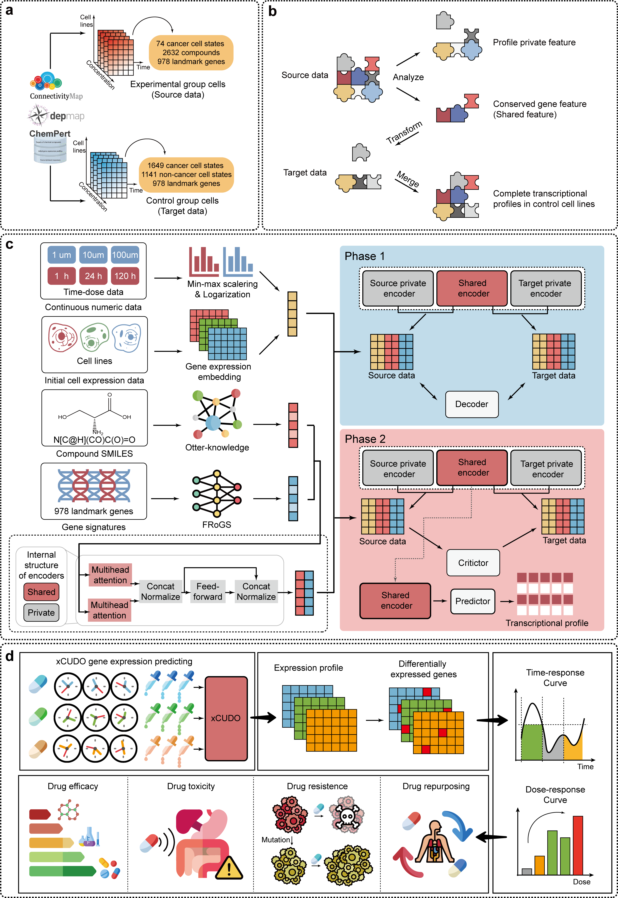

# ASCEND: Adaptive Spatiotemporal Cell Encoding for Dynamics

> **ASCEND** is a virtual-cell AI system that simulates dose- and time-dependent transcriptomic responses across thousands of cellular states.  
> It enables large-scale drug repositioning and target discovery through cross-cell dynamic modeling and multi-omics integration.

---

## 🌟 Overview

- ⏱️ **Time-Sensitive Analysis**：Predicting the dynamic response trajectory of cells across different time points.
- 💊 **Dose-Dependent Modeling**：Modeling Non-Linear Responses to Changes in Drug Dosage.
- 🧪 **Resistance Profiling**：Elucidating potential resistance mechanisms following prolonged drug exposure.
- 🧬 **Virtual Cell Simulation**：Cell-level modeling based on *in vitro* data.
- 🧠 **Drug Repositioning**：Exploring new applications for existing drugs in various disease states.

---

## 🧩 ASCEND Framework



> **Figure | ASCEND Overall Architecture.**  
> **(a) Data collecting and processing:** Integrates multi-source data including drug SMILES structures, perturbation transcriptomes, baseline cell expression, and continuous metadata (time, concentration).
> **(b) Model framework principle:** The core principle is to disentangle a transcriptomic profile into cell-specific private features and perturbation-induced, cross-cell-line shared features.
> **(c) Model architecture:** The model first uses an orthogonal autoencoder to separate private and shared latent features (Phase 1). Subsequently, it employs adversarial training to align the shared feature space across domains, enabling generalization (Phase 2).
> **(d) Application Layer:** Provides interpretable outputs for pharmacodynamics, toxicology, drug resistance, and drug repurposing.

---

## 💾 Download Model and Datasets

ASCEND requires both preprocessed datasets and trained model checkpoints for reproduction.  

### 📦 1️⃣ Download Preprocessed Data  
You can **download prepared files** from the links below and put them in a new folder named */data*.
| Dataset | Description | Download Link |
|----------|--------------|----------------|
| **ASCEND Dataset** | Drug–Target interaction matrix (used for model input) | [📥 Download](https://doi.org/10.5281/zenodo.17292259) |


### 🧠 2️⃣ Download Pretrained Models 
You can **download trained model** from the links below and put them in a new folder named */trainedModel* under */results* folder.
| Model | Description | Download Link |
|--------|--------------|----------------|
| **ASCEND-base** | Virtual cell model trained on all 2,790 cell states | [📥 Download](https://doi.org/10.5281/zenodo.17291970) |

---

## 🚀 Quick Start

### **Step 1: Installation**

Clone the repository and install dependencies:
```bash
git clone https://github.com/YY-learn-web/ASCEND.git
cd ASCEND
conda create -n ascend python=3.9
conda activate ascend
pip install -r requirements.txt
```

### **Step 2: Infer Cellular Response Profile**
```bash
cd script
python predict.py
```

### **Step 3: Reproduce literature data**
Downloading relevant data, which has been made available for download in the **Download Model and Datasets** section.
Entering the */results* folder, use the *.ipynb* file to run the tutorial.

### **Tested Environment**

- OS: Ubuntu 22.04.5 LTS
- Python: 3.9.19
- GPU: NVIDIA A100 80GB
- Driver Version: 535.171.04
- CUDA Version: 12.2

## References

## License

MIT. See `LICENSE`.
