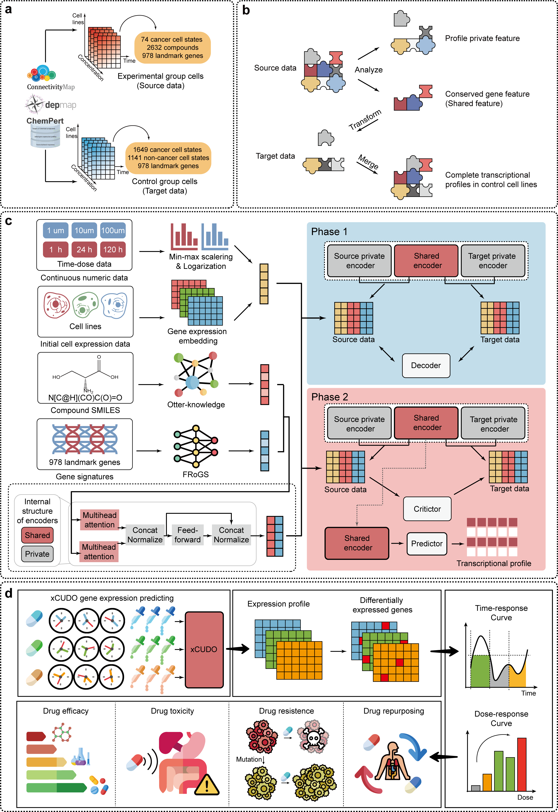

# xCUDO: Cross-Cell Universal Dynamic Omics Platform

> **xCUDO** is a virtual-cell AI system that simulates dose- and time-dependent transcriptomic responses across thousands of cellular states.  
> It enables large-scale drug repositioning and target discovery through cross-cell dynamic modeling and multi-omics integration.

---

## 🌟 Overview

- ⏱️ **Time-Sensitive Analysis**：Predicting the dynamic response trajectory of cells across different time points.
- 💊 **Dose-Dependent Modeling**：Modeling Non-Linear Responses to Changes in Drug Dosage.
- 🧪 **Resistance Profiling**：Elucidating potential resistance mechanisms following prolonged drug exposure.
- 🧬 **Virtual Cell Simulation**：Cell-level modeling based on *in vitro* data.
- 🧠 **Drug Repositioning**：Exploring new applications for existing drugs in various disease states.

---

## 🧩 xCUDO Framework



> **Figure | xCUDO Overall Architecture.**  
> **(a) Data collecting and processing:** Integrates multi-source data including drug SMILES structures, perturbation transcriptomes, baseline cell expression, and continuous metadata (time, concentration).
> **(b) Model framework principle:** The core principle is to disentangle a transcriptomic profile into cell-specific private features and perturbation-induced, cross-cell-line shared features.
> **(c) Model architecture:** The model first uses an orthogonal autoencoder to separate private and shared latent features (Phase 1). Subsequently, it employs adversarial training to align the shared feature space across domains, enabling generalization (Phase 2).
> **(d) Application Layer:** Provides interpretable outputs for pharmacodynamics, toxicology, drug resistance, and drug repurposing.

---

## 💾 Download Model and Datasets

xCUDO requires both preprocessed datasets and trained model checkpoints for reproduction.  
You can either **download prepared files** from the links below or **generate them locally** following the provided scripts.

### 📦 1️⃣ Download Preprocessed Data  
| Dataset | Description | Download Link |
|----------|--------------|----------------|
| **DrugBank (DTI subset)** | Drug–Target interaction matrix (used for model input) | [📥 Download](https://zenodo.org) |
| **LINCS L1000** | Perturbation transcriptomic profiles (dose & time) | [📥 Download](https://) |

### 🧠 2️⃣ Download Pretrained Models  
| Model | Description | Download Link |
|--------|--------------|----------------|
| **xCUDO-base** | Virtual cell model trained on all 2,790 cell states | [📥 Download](https://zenodo.org/record/1234567/files/xCUDO_base.pt) |

---

## 🚀 Quick Start

### **Step 1: Installation**

Clone the repository and install dependencies:
```bash
git clone https://github.com/YY-learn-web/xCUDO.git
cd xCUDO
pip install -r requirements.txt
```

### **Step 2: Train Model**
```bash
cd script
sh main.sh > ../results/Model/train.log
```

### **Step 3: Infer Cellular Response Profile**
```bash
cd script
python predict.py
```
## References

